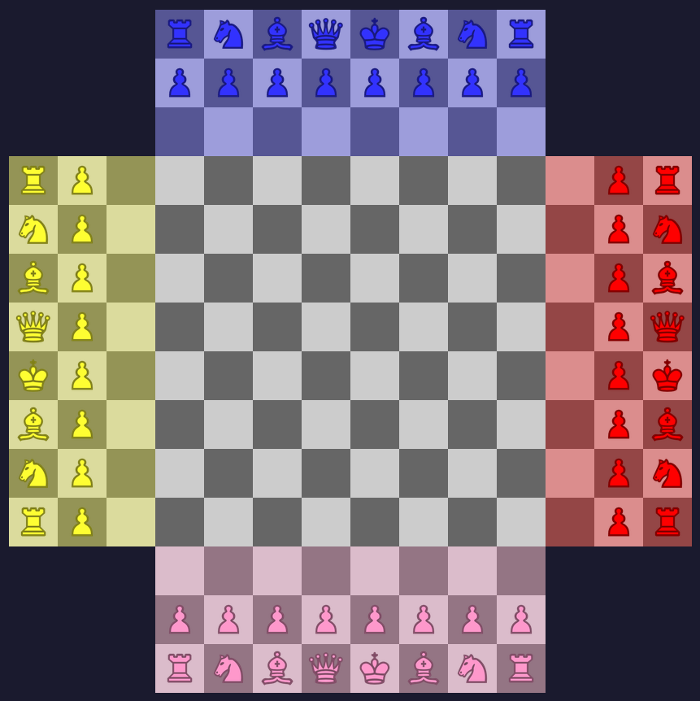

# 4 Player Chess

A browser-based four-player chess variant played on a plus-shaped board. Each of
the four armies starts on one arm of the cross and fights a free-for-all: every
player is hostile to every other, and there are no teams or alliances.

The board, the four-armies layout, and a set of custom pawn movement rules make
this a distinct game rather than standard chess with extra players.

---

## The Board

A plus / cross shape, formed from a central **8×8** block with four **8×3** arms
extending from its edges.

- **Total squares:** 160 (centre 64 + four arms of 24 each).
- The four **3×3 corners** of the 14×14 bounding box are **not part of the
  board**.
- Coordinates are handled internally on a 14×14 grid; the centre occupies rows
  and columns 3–10.

Each arm is described by which "side" it belongs to: **North, South, East,
West**. An arm belongs to the player who starts there, and carries that
player's colour.

---

## Players

- **Four players**, one per arm, in a **free-for-all** (no teams).
- Each player is assigned a **colour** at the start, chosen at random from the
  sprite sheet's palette. Colour is the player's **identity** for the whole
  game — side names describe only the starting arm.
- **Turn order is clockwise**, starting with South: South → West → North → East.

### Starting position

Each army occupies the **outer two ranks** of its arm, in the standard chess
back-rank order, rotated to face the centre:

- **Back rank:** Rook, Knight, Bishop, Queen, King, Bishop, Knight, Rook
- **Pawn rank:** eight pawns, one rank inward

That is **16 pieces per player, 64 in total**. The centre 8×8 starts empty.

---

## Rules

### General

- **All four players are enemies.** Any piece may capture any piece of a
  different colour.
- A piece may **never** land on a square occupied by a piece of its **own**
  colour.
- Non-pawn pieces are, at present, **free-move** (see *Implementation Status*).

### Pawns

Pawn movement depends on **which zone the pawn is standing in**, not on which
army it belongs to.

**In an arm** (any of the four 8×3 areas — its own or another player's):

- May move **one square toward or away from the centre**, along the arm's
  toward/away axis.
  - North/South arms → up/down on screen.
  - West/East arms → left/right on screen.
- May **not** move along the arm's length.
- May **capture on any of the four diagonals**.

**In the centre 8×8:**

- May move **one square forward or sideways**.
  - "Forward" is toward the centre, and is fixed per army.
- May **not** move backward (backward = toward the pawn's own home edge).
- May **capture on the two forward diagonals**.

**First move:** a pawn that has never moved may advance **two squares
forward** instead of one. This is only possible from its starting rank in its
arm, so the only direction available is forward. The two-square advance is
**blocked** if the square it passes over is occupied.

**Capture:** pawns capture **diagonally only**. A non-diagonal move must land
on an empty square.

**Promotion:** a pawn that reaches the **outermost rank of any arm other than
its own** is promoted. The promoted piece is **the piece that originally stood
on that back-rank square** — so landing on the 1st or 8th outer square yields a
rook, the 2nd or 7th a knight, the 3rd or 6th a bishop, and the 4th a queen.
The **king square promotes to a queen**. The promoted piece takes the **pawn's
colour**. A pawn may legally stand on its own arm's outer rank (having moved
backward into it) but does **not** promote there.

**En passant:** ⬜ **Not yet implemented.** Planned rule: when a pawn makes a
two-square first move and lands beside an enemy pawn, that enemy pawn may
capture it *as if* it had moved only one square, on the immediately following
move only.

---

## Implementation Status

| Area | Status |
|------|--------|
| Board rendering (plus shape, 160 squares) | ✅ Done |
| Four armies, random colours, starting layout | ✅ Done |
| Turn indicator (colour pill, turn cycling) | ✅ Done |
| Click-to-move, pick-up and preview | ✅ Done |
| Pawn movement (zone-based) | ✅ Done |
| Pawn captures (diagonal only) | ✅ Done |
| Pawn two-square first move | ✅ Done |
| Pawn two-square blocking | ✅ Done |
| Pawn promotion | ✅ Done |
| No friendly landing (all pieces) | ✅ Done |
| En passant | ⬜ Not yet |
| Non-pawn movement rules | ⬜ Not yet (free-move) |
| King capture / elimination | ⬜ Not yet |
| Win condition / scoring | ⬜ Not yet |

---

## Technical Notes

- **Single HTML file.** No build step, no dependencies, no framework. Open the
  file in a browser.
- **Sprite sheet:** pieces are drawn from `img/sprites.png`, a grid of
  6 columns (piece type) × 10 rows (colour). Each cell is 128px.
  - Column order: pawn, knight, bishop, rook, queen, king.
  - Row order: black, white, pink, red, orange, yellow, green, blue,
    light-blue, purple.
- **Scaling:** each square's size is computed by `fitBoard()` from the space
  actually available (the window minus the header), so the board fills the
  screen at any size and rescales on window resize. The board is never capped
  and never scrolls.
- **Sprites** are positioned with percentage-based `background-size` and
  `background-position`, which makes them resolution-independent — one sprite
  cell maps onto one square at any board size.
- **Board state** is held in a `boardState` object keyed by `"row,col"`, with
  each entry `{ pieceType, colour, side, hasMoved, el }`. This is the single
  source of truth for what is where.

### Visual design

- Board squares: neutral greys (`#cccccc` light, `#666666` dark).
- Each arm carries a permanent **30% wash** of its owner's colour, drawn above
  the square and below the piece, so the ownership map is always visible.
- Selecting and moving a piece shows a temporary **30% wash** of the moving
  piece's colour on the origin and destination squares.
- The turn indicator is a pill filled with the current player's colour; its
  text is black or white, chosen by the colour's perceived luminance
  (Rec. 601), so it is always legible.

---

## Changelog

Reconstructed from development notes. Entries from 011 onward are the reliably
recorded sequence; the original development (001–010) predates the numbering
system and is summarised as a single phase below.

### Pre-numbering (001–010)

- Initial 8×8 board displaying randomly coloured chess pieces from a sprite
  sheet.
- Fix: pieces were created but never appended into their square, so they did
  not display.
- Fluid square sizing so the board fits any screen (width and height).
- Fix: board overflowing the text at extreme browser zoom.
- Plus-shaped board (central 8×8 + four 8×3 arms, 160 squares).
- Four armies, one per arm, random colours from the sprite palette, arranged
  in a standard two-rank starting formation rotated to face the centre.
- Turn indicator cycling through the four players.
- Click-to-move: pick up a piece, click a destination, capture on landing.

### 011

Colour highlight overlay drawn **below** the piece (board square → overlay →
sprite layering via z-index), replacing the earlier blue selection box.

### 012

The picked-up piece **follows the mouse**: it is drawn into whichever square is
hovered, correctly positioned in the grid, and committed on click.

### 013

Move highlight made **fully solid** (removed the 60% opacity that let the board
colour bleed through).

### 014

**Pawn movement restrictions** by zone: in an arm, one square along the arm's
axis; in the centre, forward or sideways per the pawn's army; never backward.

### 015

Clarity refactor: the **side is stored on each piece** so movement rules read
the orientation directly, with no colour lookup.

### 016

**Pawn two-square first move** (forward only, from the start rank).

### 017

**Pawn diagonal captures**: two forward diagonals in the centre, all four
diagonals in an arm; diagonal onto an empty square is illegal.

### 018

**No friendly landing** for every piece (previously only pawns were blocked).

### 019

Removed the pawn's own colour test — with the universal friendly-landing check,
the pawn only needs to test occupancy.

### 020

Greyscale board (`#cccccc` / `#666666`); arm tint and move overlay both set to
30%.

### 021

Trimmed `sprites.png` to **10 rows** (removed the two grey rows); sprite
scaling updated to `600% × 1000%`.

### 022

Removed the ring around the colour swatch.

### 023

Removed the swatch; the turn pill is now filled with the player's colour and
its text uses the **XOR-inverted** colour.

### 024

Replaced the JS colour inversion with CSS `filter: invert(100%)`.

### 025

Replaced inversion with **luminance-based** text colour (Rec. 601 threshold at
128): black or white text, whichever contrasts with the pill.

### 026

**Pawn two-square blocking**: the square passed over by a two-square advance
must be empty.

### 027

**Pawn promotion.** A pawn reaching the outermost rank of any arm other than
its own is promoted to the piece that originally occupied that back-rank
square (king square → queen), in the pawn's own colour. En passant added to
the README as a planned (not yet implemented) rule.

---

## Running

1. Place `sprites.png` in an `img/` folder next to the HTML file.
2. Open the HTML file in any modern browser.
3. No server or build
